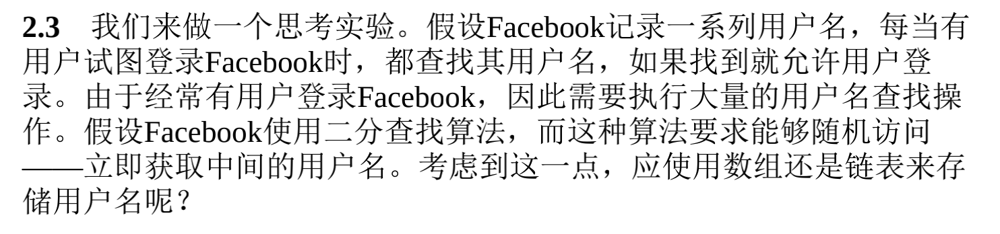

二分查找

- 输入：有序的元素列表
- 如果查找的元素包含在列表中，二分查找返回其位置，否则返回null

**对应的数据结构**

二分查找要求能够随机访问——不可使用链表

**举例思考：**

A：应该使用数组

A：只能在最后面添加新用户

混合结构的速度应该是居中，均衡两个极端。

但应该更偏向链表的性能，因为数组长度只有26，链表相当于无限制的长。

| 操作 | 数组 | 混合结构 | 链表 |
| ---- | ---- | -------- | ---- |
| 查找 | 1    | 2        | 3    |
| 插入 | 3    | 2        | 1    |
|      |      |          |      |

