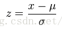
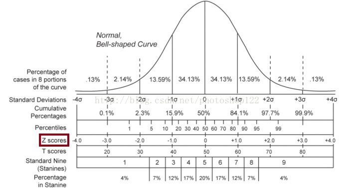

# 如何在 sklearn 中使用 KNN(手写数字识别)

在 Python 的 sklearn 工具包中有 KNN 算法。

KNN 既可以做分类器，也可以做回归。

## 引入数据集

使用sklearn自带的手写数字数据集,并获取特征值矩阵feature和 分类标签向量 target

```
from sklearn import datasets
digits = datasets.load_digits()
feature = digits.feature()
target = digits.target()
```

## 在sklearn中引入KNN分类器

如果是做分类，你需要引用：

``` 
from sklearn.neighbors import KNeighborsClassifier
```

如果是做回归，你需要引用：

```
from sklearn.neighbors import KNeighborsRegressor
```

一般来说如果一个算法有 Classifier 类，都能找到相应的 Regressor 类。比如在决策树分类中，你可以使用 DecisionTreeClassifier，也可以使用决策树来做回归 DecisionTreeRegressor。

好了，我们看下如何在 sklearn 中创建 KNN 分类器。

## 在 sklearn 中创建 KNN 分类器

这里，我们使用构造函数

```
knn = KNeighborsClassifier(n_neighbors=5, weights=‘uniform’, algorithm=‘auto’, leaf_size=30)
```

这里有几个比较主要的参数：

1. **n_neighbors：**即 KNN 中的 K 值，代表的是邻居的数量。

   - K 值如果比较小，会造成过拟合。
   - 如果 K 值比较大，无法将未知物体分类出来。
   - 一般我们使用默认值 5。

2. **weights：**是用来确定邻居的权重，有三种方式：

   - weights=uniform，代表所有邻居的权重相同；
   - weights=distance，代表权重是距离的倒数，即与距离成反比；
   - 自定义函数，你可以自定义不同距离所对应的权重。

   大部分情况下不需要自己定义函数。

3. **algorithm**：用来规定计算邻居的方法，它有四种方式：
   - algorithm=auto，根据数据的情况自动选择适合的算法，默认情况选择 auto；
   - algorithm=kd_tree，也叫作 KD 树，是多维空间的数据结构，方便对关键数据进行检索，不过 KD 树适用于**维度少的情况，一般维数不超过 20**，如果维数大于 20 之后，效率反而会下降；
   - algorithm=ball_tree，也叫作球树，它和 KD 树一样都是多维空间的数据结果，不同于 KD 树，球树更适用于**维度大**的情况；
   - algorithm=brute，也叫作暴力搜索，它和 KD 树不同的地方是在于采用的是线性扫描，而不是通过构造树结构进行快速检索。当训练集大的时候，效率很低。
4. **leaf_size**：代表构造 KD 树或球树时的叶子数，默认是 30，调整 leaf_size 会影响到树的构造和搜索速度。

## Sklearn将样本集划分为测试集，训练集 train_test_split


在机器学习中，该函数可按照用户设定的比例，随机将样本集合划分为训练集 和测试集，并返回划分好的训练集和测试集数据。

**代码示例**

```
import numpy as np
from sklearn.model_selection import train_test_split

#用train_test_split函数划分出训练集和测试集，测试集占比0.25
train_x, test_x, train_y, test_y = train_test_split( feature, traget, test_size=0.25)

```

**train_test_split语法**

``` 
X_train,X_test, y_train, y_test =cross_validation.train_test_split(X,y,test_size, random_state)
```

**参数说明**
X	待划分的样本特征集合
y	待划分的样本标签
test_size	若在0~1之间，为测试集样本数目与原始样本数目之比；若为整数，则是测试集样本的数目。
random_state	随机数种子
X_train	划分出的训练集数据（返回值）
X_test	划分出的测试集数据（返回值）
y_train	划分出的训练集标签（返回值）
y_test	划分出的测试集标签（返回值） 

## 对数据进行归一化处理StandardScaler

因为 KNN 算法和距离定义相关，我们需要对数据进行规范化处理，采用 Z-Score 规范化。

示例：

```
from sklearn import  preprocessing
ss = preprocessing.StandardScaler()
train_ss_x = ss.fit_transform(train_x)
test_ss_x = ss.transform(test_x)
```

**Z-score**

   由于Z-score的数据分布满足“正态分布”(N(0,1))，而“正态分布”又被称为“Z-分布”，所以该方法被称为“Z-score”。

   Z-score是用于做数据规范化处理的一种方法。

   Z-score又称：零-均值规范化、standardscore、Z-value。

（2）Z-score公式

   Z-score的计算公式如下：

​     
   其中x是原始数据，u是全部数据的均值，分母为标准方差。

（3）Z-score分布

   Z-score的分布如下图所示：


（注：本图转载自wikipedia）

（4）Z-score物理意义

   Z-score表示原始数据偏离均值的距离长短，而该距离度量的标准是标准方差。

   Z-score大于零表示该数据大于均值。

   Z-score小于零表示该数据小于均值。

   Z-score等于零表示该数据等于均值。

   Z-score等于“1”表示该数据比均值大一个标准方差。

   Z-score等于“-1”表示该数据比均值小一个标准方差。

   如果统计数据量足够多，Z-score数据分布满足，68%的数据分布在“-1”与“1”之间，95%的数据分布在“-2”与“2”之间，99%的数据分布在“-3”与“3之间”。可以通过此对你的数据做一定的验证。相见上面的Z-score数据分布图。

（5）Z-score应用

   Z-score可用于数据分布过于凌乱，无法判断最大值与最小值，或者数据中存在过多的奇异点，可以用Z-score方法对数据做规范化处理。

   其实Z-score也是一种数据归一化处理的一种方法。


## 输入训练集，对分类器进行训练 fit

创建完 KNN 分类器之后，我们就可以输入训练集对它进行训练。

**训练：**这里我们使用` fit() `函数，传入训练集中的样本特征矩阵和分类标识，会自动得到训练好的 KNN 分类器。

**预测：**然后可以使用` predict()` 函数来对结果进行预测，这里传入测试集的特征矩阵，可以得到测试集的预测分类结果。

使用示例：

```
knn.fit(train_ss_x,train_y)
predict_y = knn.predict(test_ss_x)
```

## sklearn 计算准确率 accuracy_score

**sklearn使用示例**

```
from sklearn.metrics import accuracy_score

print('KNN准确率：%.4lf' % accuracy_score(test_y,predict_y))
```

分类准确率：找出测试值与预测值不同总数除以测试值总数

```
sum(y_test == y_predict) / len(y_test)
```

**accuracy_score（）函数**
**函数功能**
分类正确率分数，函数返回一个分数，这个分数或是正确的比例，或是正确的个数。

```
accuracy_score(y_true, y_pred, *, normalize=True, sample_weight=None):
```

**参数解读**

 - y_true：正确输出值。y_pred：经过网络的预测值，分类器输出值。
  y_treue和y_pred可以选择的类型一样，包括：一维数组、矩阵。
  - normalize：normalize是布尔类型参数，如果是False的话，函数就返回样本分类的正确数量。如果是True的话，返回分类正确率。默认情况下数True的，也就是返回正确率。
  - sample_weight:样本的权重，默认是None。
