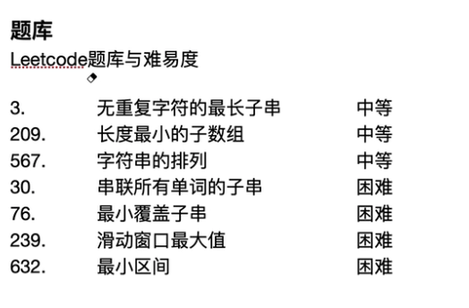

# 滑动窗口

## 适合场景

输入：数组或字符串。

输出：符合条件的 数组或字符串的连续子串（的相关属性）。



## 思路

设置滑动窗口，根据约束条件的不同，窗口长度分为定长或者变长。

增加变量——窗口的状态变量，用空间复杂度换取时间复杂度。

- 变长窗口：
  - 当窗口内的数据不满足约束条件的时候，窗口扩张，右边界右移winRight+1，修改窗口状态变量；
  - 当窗口内数据满足约束条件的时候，窗口收缩，左边界右移至满足约束条件的新位置winLeft，修改窗口状态变量；
  - 如此循环直至右边界winRight抵达待搜索string/Array的边界，输出需要的状态变量。
- 定长窗口（winLeft 和winRight的相对值固定 ）
  - 当窗口内的数据不满足约束条件的时候，窗口移动，左右边界都右移，winLeft+1, winRight+1，修改窗口状态变量，
  - 当窗口内数据满足约束条件的时候，窗口不再移动，返回修改窗口状态变量；
  - 如此循环直至右边界winRight抵达待搜索string/Array的边界，输出需要的状态变量。


# Leetcode 3 变长窗口

## **题目描述**

[3. 无重复字符的最长子串](https://leetcode-cn.com/problems/longest-substring-without-repeating-characters/)      难度中等

给定一个字符串 `s` ，请你找出其中不含有重复字符的 **最长子串** 的长度。

**示例 1:**

```
输入: s = "abcabcbb"
输出: 3 
解释: 因为无重复字符的最长子串是 "abc"，所以其长度为 3。
```

**示例 2:**

```
输入: s = "bbbbb"
输出: 1
解释: 因为无重复字符的最长子串是 "b"，所以其长度为 1。
```

**示例 3:**

```
输入: s = "pwwkew"
输出: 3
解释: 因为无重复字符的最长子串是 "wke"，所以其长度为 3。
     请注意，你的答案必须是 子串 的长度，"pwke" 是一个子序列，不是子串。
```

**示例 4:**

```
输入: s = ""
输出: 0
```

**提示：**

- `0 <= s.length <= 5 * 104`
- `s` 由英文字母、数字、符号和空格组成

## 解法

**一句话解法**：变长的窗口。

s的子串不含有重复字符，即窗口中不含有重复字符。

- 当窗口满足条件时，窗口右边界扩展。

- 当窗口不满足条件，即当出现重复字符x时，
  - 记录当前窗口的长度，
  - 更新窗口左边界。左边界更新为当前窗口出现字符x的下一位置。
- 窗口右边界循环至s的末尾

**复杂度分析**


**代码**

```
class Solution:
    def lengthOfLongestSubstring(self, s: str) -> int:
        # 输入条件，边界检查
        if(len(s) == 0):
            return 0
        winStart = 0
        winEnd = 0
        maxLen = 0
        for winEnd in range(len(s)):
            if s[winEnd] not in  s[winStart:winEnd]:
                maxLen = max(maxLen, winEnd-winStart+1)
                continue
            else:
                winStart = winStart + s[winStart:winEnd].index(s[winEnd])+1
        return maxLen
```

## Python语法 

1. s.index(s[n]) == n
2. For +( if +continue )== while + (i+1)

# Leetcode 209  变长窗口

## 题目描述

[209. 长度最小的子数组](https://leetcode-cn.com/problems/minimum-size-subarray-sum/)

给定一个含有 n 个正整数的数组和一个正整数 target 。

找出该数组中满足其和 ≥ target 的长度最小的 连续子数组 [numsl, numsl+1, ..., numsr-1, numsr] ，并返回其长度。如果不存在符合条件的子数组，返回 0 。

 示例 1：

输入：target = 7, nums = [2,3,1,2,4,3]
输出：2
解释：子数组 [4,3] 是该条件下的长度最小的子数组。
示例 2：

输入：target = 4, nums = [1,4,4]
输出：1
示例 3：

输入：target = 11, nums = [1,1,1,1,1,1,1,1]
输出：0


提示：

1 <= target <= 109
1 <= nums.length <= 105
1 <= nums[i] <= 105


进阶：

如果你已经实现 O(n) 时间复杂度的解法, 请尝试设计一个 O(n log(n)) 时间复杂度的解法。

## 解法1 滑动窗口

**代码** 

```
def minSubArrayLen(target,nums):
		if target == 0 or len(nums)==0:
			return 0
		minLen = len(nums)+1
		winStart = 0
		winEnd = 0 
    sums = 0
		for winEnd in range(len(nums)):
			sums += nums[winEnd]
			if sums >= target:
				minlen= min(minLen,winEnd-winStart+1)
				sums = sums - nums[winStart]
				winStart = winStart+1
				continue
				
		if minLen>len(nums):
			return 0
		else:
			return minLen
				
```

## 解法2  二分查找

**一句话解法**：前缀和 加 二分查找

因为题目给出 1 <= nums[i] <= 105， 那么可以使用前缀和 加二分查找做
            1. 因为元素都大于0，所以前缀和肯定是递增的
            2. 我们以每一个元素为起始位置，二分找第一个大于 target的重点位置， 比较那个最小
                        二分查找一次是 logn,  一共查找n次      那么时间复杂度为 O(nlogn)

https://leetcode-cn.com/problems/minimum-size-subarray-sum/solution/python3qian-zhui-he-xiang-xi-si-lu-by-15-8szt/

**代码**

```
class Solution:
    def minSubArrayLen(self, s: int, nums: list) -> int:
        """
            因为题目给出 1 <= nums[i] <= 105， 那么可以使用前缀和 加二分查找做
            1. 因为元素都大于0，所以前缀和肯定是递增的
            2. 我们以每一个元素为起始位置，二分找第一个大于 target的重点位置， 比较那个最小
            二分查找一次是 logn,  一共查找n次
            那么时间复杂度为 O(nlogn)
        """
        n = len(nums)
        # 1. 计算前缀和, 初始长度为 n + 1, 方便计算. 任意 长度的和，均等于 prefix[i] - prefix[i - 1]
        prefix = [0] * (n + 1)
        for i in range(0, n):
            prefix[i + 1] = prefix[i] + nums[i]
        
        # 2. 定义二分查找方法
        def binarySreach(nums, start, target):
            """
                1. 这里要理清楚， 假如 nums = 1 2 3 4，  prefix是 0 1 3 6 10 长度是 n + 1.
                2. 依次遍历 nums， start 假如为1， 对应 nums的元素2， 前缀和prefix里对应的是 3， 下标为 2！ 计算nums里 2 + 3 + 4 的和， 对应到 prefix里是 prefix[n] - prefix[1], 所以搜索起来是从 start + 1开始到最后
                3. start对应 nums元素下标，  start + 1 对应的是 prefix中， 此元素的前缀和。
            """
            left = start + 1
            # 这里的nums 是 prefix
            right = len(nums) - 1
            while left < right:
                middle = (left + right) // 2 
                if nums[middle] - nums[start] >= target:
                    right = middle
                else:
                    left = middle + 1
            
            # 看最后一个位置 是否符合，有可能小于
            return left - start if nums[left] - nums[start] >= target else n + 1


        # 3. 寻找满足条件长度最小子数组
        minLength = n + 1
        # 使 nums 前n个元素都作为开始元素， 计算第一个 大于 target的子数组长
        for i in range(n):
            length = binarySreach(prefix, i, s)
            minLength = min(minLength, length)
        
        return minLength if minLength != n + 1 else 0
作者：1501615430
链接：https://leetcode-cn.com/problems/minimum-size-subarray-sum/solution/python3qian-zhui-he-xiang-xi-si-lu-by-15-8szt/
来源：力扣（LeetCode）
著作权归作者所有。商业转载请联系作者获得授权，非商业转载请注明出处。
```


# leetcode 567 定长窗口

## 题目描述

[567. 字符串的排列](https://leetcode-cn.com/problems/permutation-in-string/)       难度中等 

给你两个字符串 `s1` 和 `s2` ，写一个函数来判断 `s2` 是否包含 `s1` 的排列。如果是，返回 `true` ；否则，返回 `false` 。

换句话说，`s1` 的排列之一是 `s2` 的 **子串** 。

**示例 1：**

```
输入：s1 = "ab" s2 = "eidbaooo"
输出：true
解释：s2 包含 s1 的排列之一 ("ba").
```

**示例 2：**

```
输入：s1= "ab" s2 = "eidboaoo"
输出：false 
```

**提示：**

- `1 <= s1.length, s2.length <= 104`
- `s1` 和 `s2` 仅包含小写字母

## 解法1 

**一句话解题**：窗口长度固定的滑动窗口。

1. 首先符合要求的是s2的子串，也就是说一定是s2的窗口内的数据
2. 那么窗口要符合什么条件呢？题目要求s2的子串是s1的排列之一。那么窗口的长度是固定的，等于s1的长度。时间复杂度：最坏的遍历是O(n-len(s1)) = O(n),即窗口end一直到最后s2的最后一个位置。
3. 定长的窗口，其中的数据要怎么才能和s1的某种排列相匹配呢？一种方法是，遍历得到s1的所有排列可能，与s2子串一一对比。但这样时间就太长。
   - 换一种思路，字符串有几个关键属性: 字符类型，各类型的字符数量，字符顺序。这3个属性可以唯一确定一个string。
   - 当要求某种排列匹配时，即可以不考虑字符顺序，那么只需要字符类型及相应的数量相同，就满足条件。
   - 也就是说s2子串和s1，需要 字符类型和对应数量相同。需要计算的是，s1的字符类型对应的数量，以及s2窗口内子串的字符类型及对应的数量。

**复杂度分析**：

**时间复杂度：**O(n-m)*O(n)+O(m)  = O(n(n-m))  m<=n

子串的遍历次数：最坏的遍历是O(len(s2)-len(s1)) ,即窗口end一直到最后s2的最后一个位置。

子串每次遍历时，计算子串字符类型及对应的字符数量的计算，O(len(s1))

**空间复杂度：**每次计算子串的字符集数量时，需要一个变量保存子串。最坏O(len(s2)-len(s1))

**代码：**

```
#
# @lc app=leetcode.cn id=567 lang=python3
#
# [567] 字符串的排列
#
# @lc code=start
from collections import Counter

class Solution:
    def checkInclusion(self, s1: str, s2: str) -> bool:
    		#输入值的边界检查
        if len(s1)==0 or len(s2)==0 or len(s1)>len(s2):
            return False
        winStart =0
        winEnd = winStart +len(s1)-1
        countS1= Counter(s1)
        curCountS2 ={}
        while winEnd<len(s2):
            curCountS2 = Counter(s2[winStart:winEnd+1])
            if curCountS2 == countS1:
                return True
            else:
                winEnd += 1
                winStart += 1
        return False
```

### python语法 collections.counter

## 解法2

**一句话解法：**

由于限定了s1,s2都是小写字母，所以可以设置2个dict，分别记录s1和s2子串每个字母出现的次数。

每次的滑动窗口，只要更新记录s2的dict。

再对比s1的dict和s2的dict是否相同，相同即满足条件退出循环，否则进行窗口滑动。

**复杂度分析**

时间复杂度分析：O(n)*O(n-m)+O(m) = O(n(n-m))   m<=n

最坏要遍历到s2的末尾 O(len(s2)-len(s1)),每次更新s2的dict需要len(s1)步——O(len(s1))

```
# @lc app=leetcode.cn id=567 lang=python3
# [567] 字符串的排列
# 解法二
# @lc code=start
import string
class Solution:
    def checkInclusion(self, s1: str, s2: str) -> bool:
        if len(s1)==0 or len(s2)==0 or len(s1)>len(s2):
            return False

        countS1 = {k:0 for k in string.ascii_lowercase}
        countS2 = {k:0 for k in string.ascii_lowercase}
        for s in s1:
            countS1[s] += 1 
        for i in range(len(s2)):
            countS2[s2[i]] += 1
            if i>= len(s1):
                countS2[s2[i-len(s1)]] -= 1
            if countS2 == countS1:
                return True
        return False      
# @lc code=end
```

### Python语法 string.ascii_lowercase  

